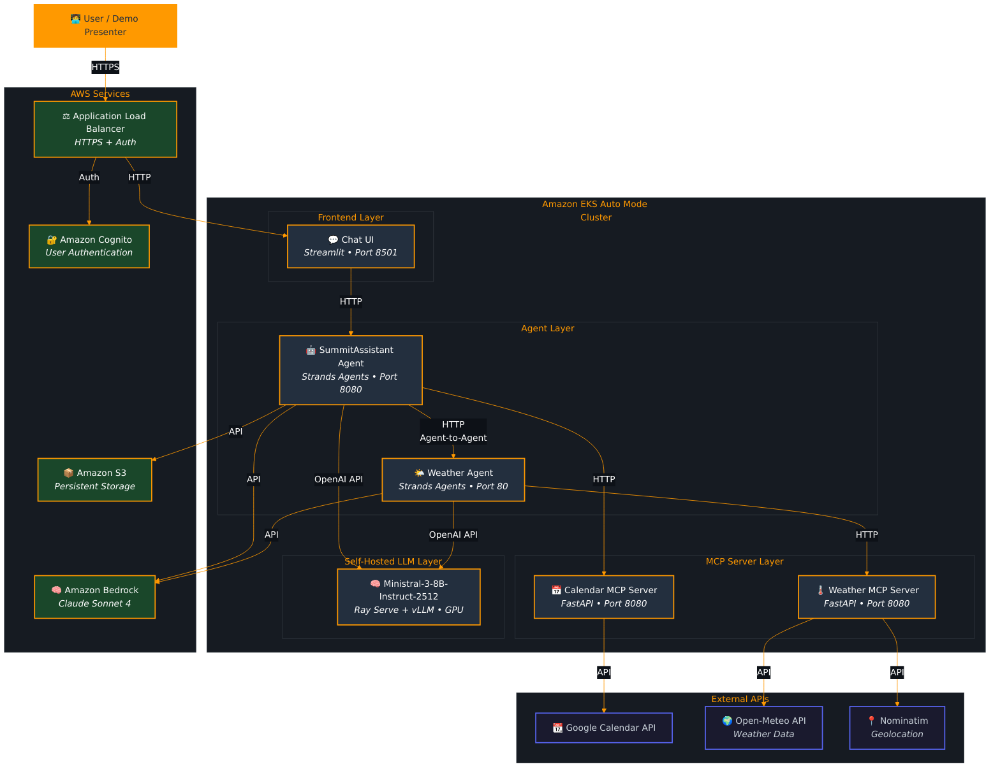

# From Models to Agents: Running LLM-Powered AI Applications on Amazon EKS Auto Mode

## Objectives

- GPU-optimized EKS Auto Mode cluster with NVIDIA device plugin support
- Ray Serve orchestration for scalable distributed inference
- Deploy the Mistral-7B-Instruct-v0.3 model using RayServe and vLLM.
- Mistral-7B-Instruct-v0.3 model served via vLLM for optimal performance

## Architecture



### Create the cluster

- From AWS EKS console or eksctl or terraform
- Complete prerequisite in [readme](./README.md)

### Verify NodePools, Node and NodeClass

```bash
kubectl get nodes,nodepool
```

### Create GPU NodePool

```bash
kubectl apply -f infra/nodepool-gpu.yaml
```

### vLLM Serving Script ConfigMap

```bash
cat ray-vllm/vllm-s3-configmap.yml 

kubectl apply -f ray-vllm/vllm-s3-configmap.yml 
```

### Deploy the KubeRay Operator

```bash
# Add the Ray Helm repository
helm repo add kuberay https://ray-project.github.io/kuberay-helm/

# Install the KubeRay Operator
helm install kuberay-operator kuberay/kuberay-operator --version 1.1.0

# Verify the operator deployment
kubectl wait pods --for=jsonpath='{.status.phase}'=Running -l app.kubernetes.io/name=kuberay-operator --timeout=300s
kubectl get pods
```

### Before deploying the RayService, let's examine the storage configuration

*This lab uses pre-created Persistent Volume (PV) and Persistent Volume Claim (PVC) that leverage the S3 Mount Point CSI Driver to provide access to model files stored in S3.*

# Download the Model and store in S3

```bash
kubectl apply -f infra/Ministral-3-8B-download-job.yaml
```

```bash
# Check the Persistent Volume
kubectl get pv mistral-model-pv -o wide

# Check the Persistent Volume Claim
kubectl get pvc mistral-model-pvc -o wide

# Get detailed information about the PV to see S3 configuration
kubectl describe pv mistral-model-pv
```

### Create and Apply the RayService Configuration

```bash
# Apply the deployment
kubectl apply -f ray-vllm/ray-vllm-s3-service.yml
```

### Monitor the deployment

```bash
# terminal 1
kubectl get pods -w

# terminal 2
kubectl get nodes -l nvidia.com/gpu.present=true -w

kubectl get nodeclaim -w
```

### Ray Dashboard

```bash
kubectl get svc | grep vllm
```

```bash
kubectl port-forward svc/vllm 8265:8265
```

From web browser, access Ray Dashboard: `http://localhost:8265/#/overview`

### Check the Deployed vLLM Services

```bash
kubectl get svc | grep vllm
```

### Interact with the Model*

```bash
kubectl run curl --image=nginx
kubectl exec -it curl -- sh

curl -s http://vllm-serve-svc:8000/v1/completions \
  -H "Content-Type: application/json" \
  -d "{\"prompt\": \"Tell me about AWS London Summit 2026\",\"max_tokens\": 100,\"temperature\": 0}"           
```

## Agentic AI on Amazon EKS

- Build agents using Strands SDK
- Connect models with tools using the Strands framework
- Deploy agents on Amazon EKS

### Deploy to Kubernetes

```bash
kubectl apply -f summitassistant-agent/k8s/

kubectl apply -f calendar-mcp-server/k8s/

kubectl apply -f chat-ui/k8s/

kubectl apply -f weather-agent/k8s/

kubectl apply -f weather-mcp-server/k8s/
```

### Verify Deployments

```bash
kubectl get deployments,pods
```

### Test weather agent with curl

```bash
# terminal 1
kubectl port-forward svc/strands-weather-agent 8080:80

# terminal 2 
curl -s -X POST http://localhost:8080/agent \
  -H "Content-Type: application/json" \
  -d '{"query": "What time is it in Dublin?"}' \
  | jq -r '.response'

curl -s -X POST http://localhost:8080/agent \
  -H "Content-Type: application/json" \
  -d '{"query": "What is the weather in London today?"}' \
  | jq -r '.response'  
```


```text
Meeting ID: aws-london-summit-eu-2026-ams-1 

Meeting title: Meeting with AnyCompany on GenAI Models on AWS

Meeting notes content: 

- John Doe (CEO) stressed the importance of reducing cloud costs this quarter.  
- Sandra Basten (CTO) mentioned moving migrating and modernizing workloads from on-premise to AWS using Amazon EKS Auto Mode.  
- CTO mentioned they are interested in implementing GenAI workloads while relying on their existing Kubernetes knowledge.  
- Head of Engineering raised concerns about developer onboarding taking too long.  
Attendees: CEO john@AnyCompany.com, CTO sandra@AnyCompany.com, Head of Engineering alice@example.com, Product Manager sarah@AnyCompany.com, Sr. Specialist SA wale@aws.com, AWS
Timestamp: 24/03/2026, 2pm


Meeting ID: aws-london-summit-2026-ams-2 

Meeting title: Q2 Infrastructure Roadmap Planning 

Meeting notes content:

Sarah Chen (Product Manager) proposed accelerating the migration timeline to Q2 2026.
Alice Thompson (Head of Engineering) highlighted the need for better observability tools for containerized workloads.
Sandra Basten (CTO) emphasized the importance of implementing cost optimization strategies using AWS Cost Explorer and Compute Optimizer.
John Doe (CEO) requested monthly progress reports on the EKS migration.
Wale Adeyemi (Sr. Specialist SA, AWS) suggested leveraging Amazon Bedrock for the GenAI proof of concept.
Team agreed to schedule weekly sync meetings every Tuesday at 10 AM.
Attendees: CEO john@AnyCompany.com, CTO sandra@AnyCompany.com, Head of Engineering alice@example.com, Product Manager sarah@AnyCompany.com, Sr. Specialist SA wale@aws.com Timestamp: 31/03/2026, 10am

Meeting ID: kubecon-eu-2026-ams-3 
Meeting title: Developer Experience and Training Workshop 
Meeting notes content:

Alice Thompson (Head of Engineering) presented the current developer onboarding challenges and proposed a 2-week training program.
Sandra Basten (CTO) approved budget for AWS training and certification for the engineering team.
Sarah Chen (Product Manager) suggested creating internal documentation and runbooks for common EKS operations.
Wale Adeyemi (Sr. Specialist SA, AWS) offered to conduct a hands-on workshop on EKS Auto Mode and Karpenter.
Team decided to implement GitOps practices using ArgoCD for better deployment workflows.
John Doe (CEO) emphasized the need to measure developer productivity improvements after the training.
Attendees: CEO john@AnyCompany.com, CTO sandra@AnyCompany.com, Head of Engineering alice@example.com, Product Manager sarah@AnyCompany.com, Sr. Specialist SA wale@aws.com Timestamp: 07/04/2026, 3pm
```

```text
# Schedule meeting

Schedule a meeting for 2026-03-27 at 2 PM with john@AnyCompany.com. The meeting is about Discussing Amazon Nova Pro.
Duration 30mins

Schedule a meeting for 2026-03-22 at 2 PM with alice@example.com and bob@example.com. The meeting is KubeCon Demo planning. Duration is 4hrs

# Search Meetings
Show me all meetings from the 2023-02-20 to 2026-03-01
```


### Managing the Agents Content

```bash
# Delete a specific meeting by ID:
aws s3 rm s3://SummitAssistant-demo-bucket/meetings/kubecon-eu-2026-ams-1.json --region us-east-2
# Option 3: Delete Session States Only
# Delete all session states but keep meeting data:
aws s3 rm s3://SummitAssistant-demo-bucket/sessions/ --recursive --region us-east-2
aws s3 rm s3://SummitAssistant-demo-bucket/meetings/ --recursive --region us-east-2


# Option 4: List What's Stored First
# List all objects
aws s3 ls s3://SummitAssistant-demo-bucket --recursive --region us-east-2

# List only meetings
aws s3 ls s3://SummitAssistant-demo-bucket/meetings/ --region us-east-2

# List only sessions
aws s3 ls s3://SummitAssistant-demo-bucket/sessions/ --region us-east-2

aws s3 rm s3://SummitAssistant-demo-bucket/meetings/kubecon-eu-2026-ams-1.json --region us-east-2
```


## Clean up

```bash
kubectl delete -f summitassistant-agent/k8s/
kubectl delete -f chat-ui/k8s/
kubectl delete -f weather-agent/k8s/
kubectl delete -f weather-mcp-server/k8s/
kubectl delete -f calendar-mcp-server/k8s/
kubectl delete -f ray-vllm/ray-vllm-s3-service.yml
kubectl delete -f ray-vllm/vllm-s3-configmap.yml 
```

### Troubleshoot with Kiro and MCP Server Demo

**Deploy sample pod**

```bash
kubectl run frontend-app --image=nginzz 
```

Verify the pods in the cluster

```bash
kubectl get pods
```

Sample prompt in Kiro IDE 

```text
I have an Amazon EKS Auto Mode cluster named `aiml` in the us-east-1 region. I observed that a pod is not running in the cluster. Use the Amazon EKS MCP Server, troubleshoot the pod that is not in running state and fix it. 
```
